   

<!-- 

   
   
   
   

 -->

   
    
    
   
   
    
    
   

   

   
   

<!-- # Hi there 🏝 -->

   
   
   
   
   <!--
   
   -->   
   
<!-- 

      

   
   
 -->

      <h3 align='center' style='border-radius: 6px;border: solid 0.5px wheat;'>You can meet me on Linkedin, Seems I'm active there too, mate 🙂 <a href="https://linkedin.com/in/Amir-Shamsi">My Linkedin</a> 
      </h3>
  

<!--

<!--
### I'm currently working in these projects:
* [SpAlgo](https://github.com/Amir-Shamsi/SpAlgo)
* [Tocode](https://github.com/Amir-Shamsi/tocode)
* [Persian Validator](https://github.com/Amir-Shamsi/)
<!--
### Some of web projects I've worked in:
* [Iranian Red Crescent Society (IRCS)](https://edu.khadem.ir/)
* [Iran MD](https://iranmd.ir/)
* [Building Advisor](https://buildingadvisor.ir/en/)
<!--

<!--

--->
